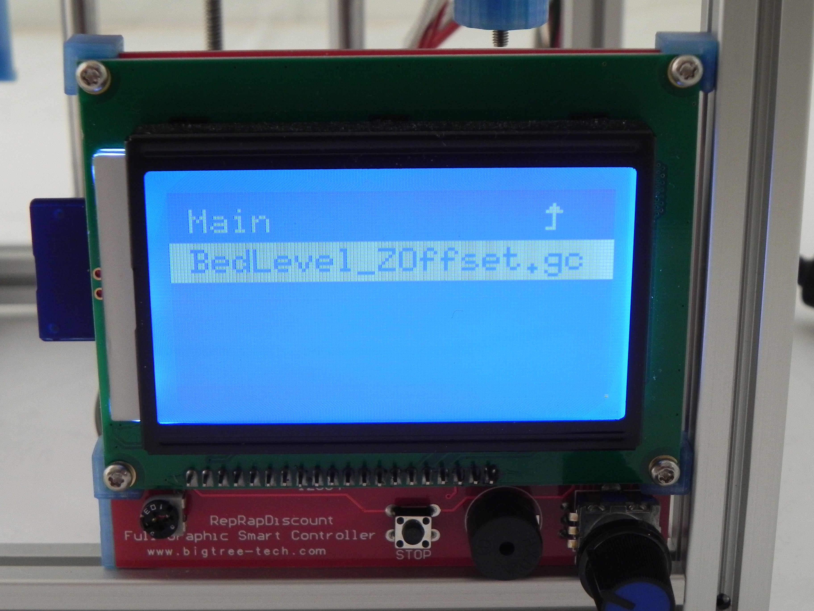
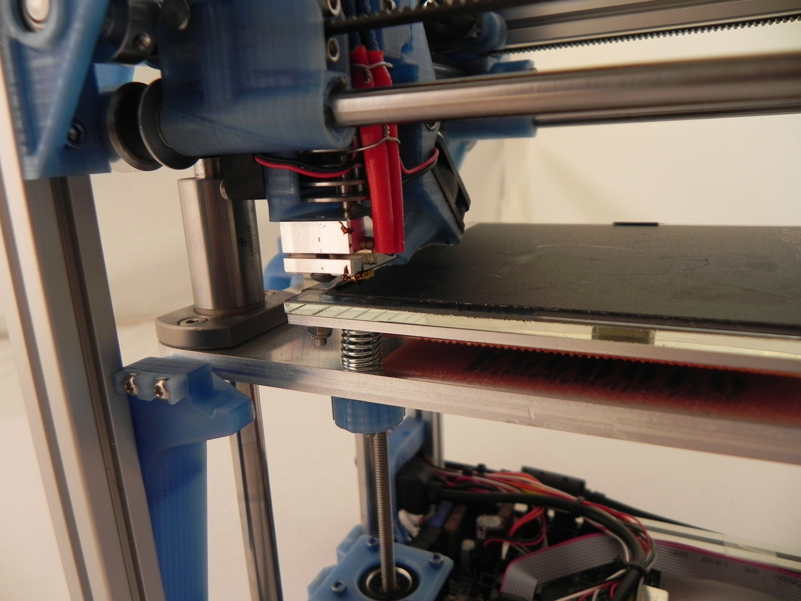
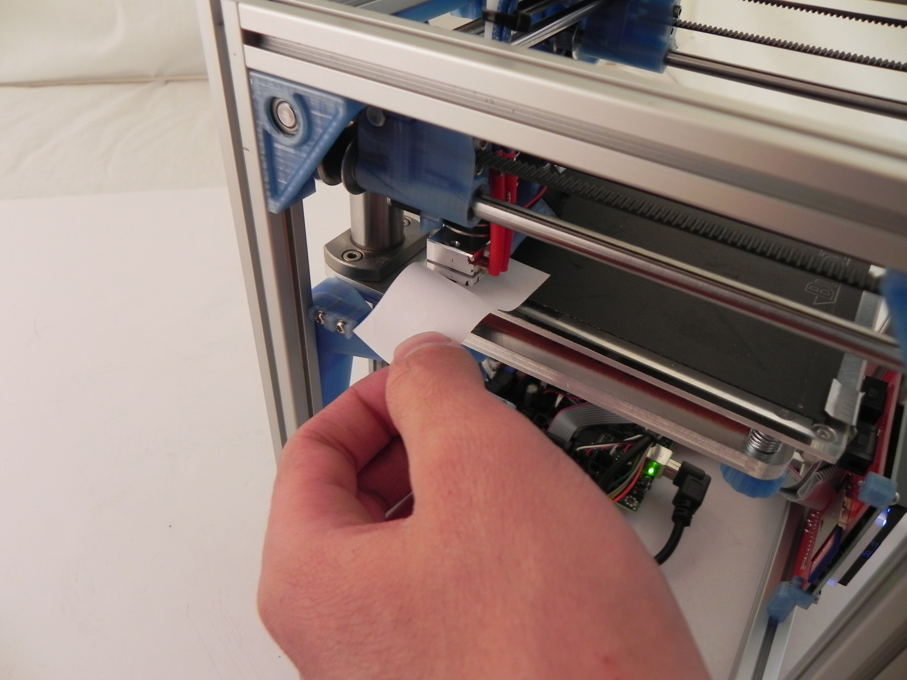
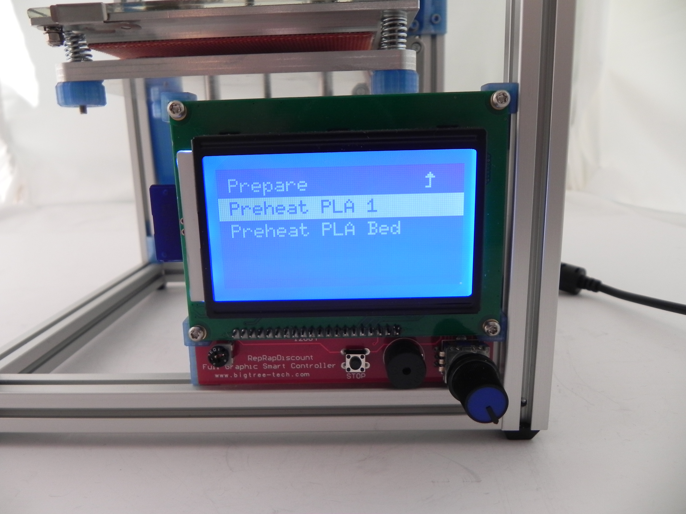
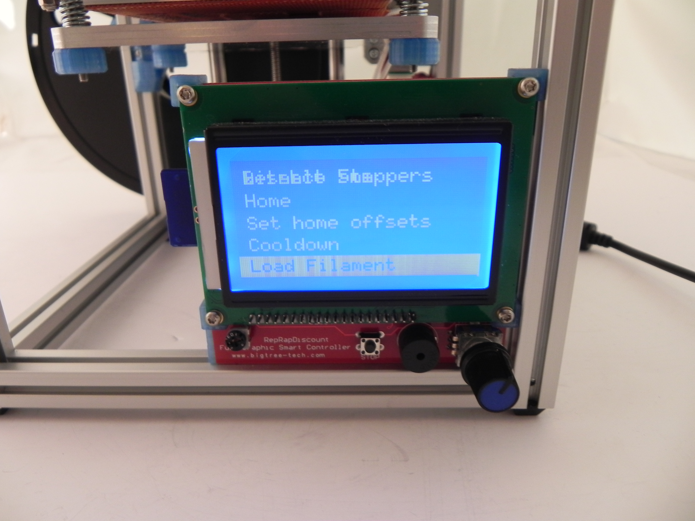
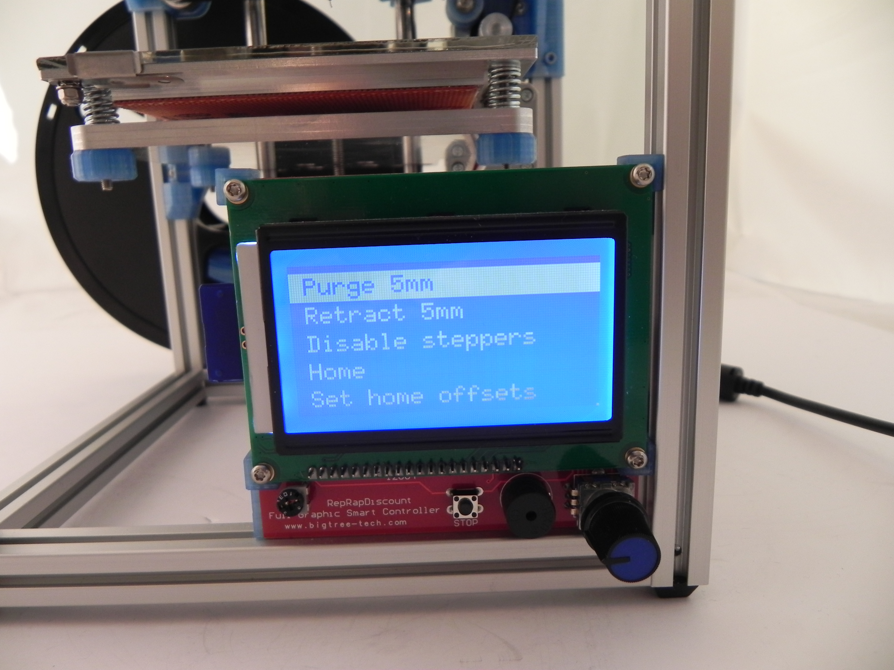
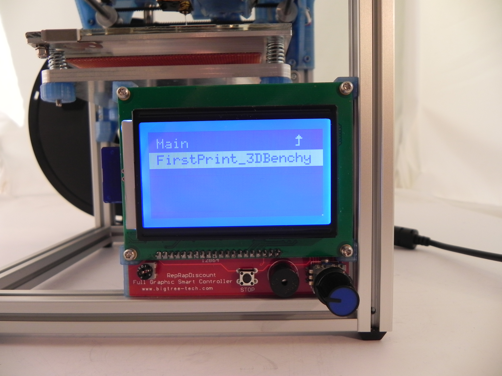

# Calibration

## Bed level and Z-axis offset calibration

Run the gcode file [BedLevel_ZOffset.gcode](https://github.com/woolfepr/Printer-Kitten/blob/master/Assembly%20Instructions/Calibration/BedLevel_ZOffset.gcode) Copy it to the SD card, put the SD card in the printer. On the bottom of the main menu on the display it should say print from SD, navigate to the file run it.

After the Z-Axis has come to rest move the print head so the nozzle is above the left rear adjustment screw.

Using about a 1"x 3" piece of standard printer paper (≈0.1mm thick) as a feeler gauge between the nozzle and build plate, turn the bed adjustment knob to move the bed up towards the nozzle. Move the bed up until as you move the piece of paper in and out you just start feeling resistance and the piece of paper buckles as you push it in.

Repeat the previous step for the front left and then front right. (note: the nozzle will not be able to move all the way right to go over the font right adjustment screw. Just move it as far right as it goes)

Power cycle the printer

## Load your PLA filament

Manually move the bed down so the nozzle is not to close to the bed

Preheat the nozzle by navigating on the LCD controller to prepare, then preheat PLA, then preheat PLA 1. Wait until the nozzle is up to more than 180 degrees C.

Cut off the tip of the filament if needed (if the end of the filament is not clean, is bent, or has a molten blob).  Mount the spool on the spool holder and feed the tip of the filament into the bottom of the extruder.

Holding the filament into the extruder, navigate on the LCD to prepare, and then load filament. The extruder should feed the filament up through the Bowden tube.

Navigate to prepare, then purge 5mm on the LCD. Purge 5mm until the filament is flowing smoothly out of the nozzle. (It doesn’t hurt to purge a little more than you probably need  in order to ensure all the air bubbles in the nozzle have come out)

Navigate to prepare, then cooldown.

## First Print

There is gcode file (no slicer needed) ready to go for a first print. [FirstPrint_3DBenchy.gcode](https://github.com/woolfepr/Printer-Kitten/blob/master/Assembly%20Instructions/First%20Print/FirstPrint_3DBenchy.gcode) Simply put it on the SD card, navigate to print from SD, and select it. Your printer should heat up and successfully print for the first time.

Once the first print is finished and you are ready to print items of your own choice or design you will need to begin using a slicer/ tool pathing program. I recommend using [Cura by Ultimaker](https://ultimaker.com/en/products/cura-software). Download and install the latest version.

The profile I have fine-tuned to run PLA on the kitten is available on Github. Kitten 1.75.ini(https://github.com/woolfepr/Printer-Kitten/blob/master/Software/Cura%20Profile/Kitten%201.75.ini)  This profile should be a good starting point as far as tuning. You will want to play with the settings in order to get the best results on different models.
